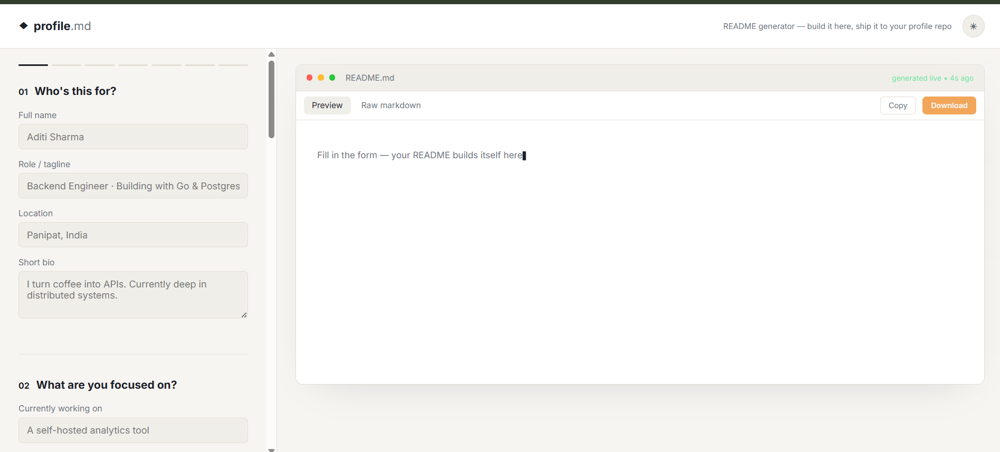

# profile.md — Profile bio tool

A small, dependency free web app that helps you build a polished `README.md`
for your GitHub profile repo (`your-username/your-username`)
the special repo GitHub renders at the top of your profile page.

Fill out a form on the left, watch it render as a real README on the right,
then copy or download the result.




> Built my own GitHub profile README using this tool —
> [check it out](https://github.com/visheshsharma20/visheshsharma20) as a
> live example of what this generates.

## Features

- Live split-pane preview, styled like an actual GitHub file view
- Bio, current focus, skills (as badges), and social links
- GitHub stats, streak stats, top languages, and trophy widgets
- Repeatable project list
- One-click copy or download as `README.md`
- Dark/light toggle for the generator itself (remembers your choice)
- License badge (MIT, Apache 2.0, GPL-3.0, BSD-3-Clause)
- Resume PDF link, rendered as a badge
- Animated typing-text header (via `readme-typing-svg`)
- Contribution snake animation downloads the companion GitHub Actions
  workflow (`snake.yml`) too, since that's the part people usually get stuck on
- Buy Me a Coffee / Ko-fi support badges
- Pure HTML/CSS/JS — no build step, no dependencies to install

## How to use it

1. **Open the generator** — either run it locally (see below) or visit the
   live GitHub Pages link if one is set up for this repo.
2. **Fill in the form**, step by step:
   - Your name, role, location, and a short bio
   - What you're currently working on / learning
   - Skills (type one, press Enter, repeat)
   - Your GitHub username + which stats widgets you want
   - Your projects (name, one-line description, link)
   - Social links, email, and support badges
   - Extras: license, resume link, animated typing header, contribution snake
3. **Watch the live preview** on the right update as you type, it's rendered
   the same way GitHub renders markdown, so what you see is what you'll get.
4. **Download** the file. This saves an actual `README.md` to your computer.
5. **Push it to your profile repo**:
   - Go to `github.com/<your-username>/<your-username>`
   - Edit the existing `README.md` (pencil icon) and paste in the new content,
     or upload the downloaded file directly
   - Commit it now shows up on your GitHub profile page

## Run it locally

Just open `index.html` in your browser. That's it.

Or serve it locally:

```bash
python3 -m http.server 8000
# then visit http://localhost:8000
```

## Deploy to GitHub Pages

1. Push this folder to a GitHub repo.
2. Go to **Settings → Pages**.
3. Under "Build and deployment", set **Source** to `Deploy from a branch`,
   pick your default branch and `/ (root)`.
4. Your generator will be live at `https://your-username.github.io/repo-name/`.

## Using the output

1. Fill in the form and download the generated file.
2. Create a repo named exactly like your GitHub username (e.g. `octocat/octocat`).
3. Drop the downloaded file in as `README.md` and push.
4. It now appears at the top of your GitHub profile.

### If you picked a license
GitHub badges are just images, add an actual `LICENSE` file to the repo too
(GitHub can generate one for you: **Add file → Create new file → name it
`LICENSE`** → it'll offer to insert a template for you).

### If you enabled the contribution snake
1. Download `snake.yml` from the generator.
2. In your profile repo, create `.github/workflows/snake.yml` and paste it in.
3. Push. The action runs on a schedule (and once on push) and publishes the
   animated SVG to an `output` branch, which the README then points to.
4. First run takes a minute, refresh your profile after the Action completes
   under the repo's **Actions** tab.

## Project structure

```
readme-generator/
├── index.html          # markup + form structure
├── style.css           # design system + layout
├── script.js           # state, markdown generation, rendering
├── screenshots/
│   ├── landing-page.png
│   └── preview.png
└── README.md           # this file
```

## Tech

Vanilla HTML/CSS/JS, [marked.js](https://marked.js.org/) (via CDN) for markdown
rendering, and badge/widget services from
[shields.io](https://shields.io/), [github-readme-stats](https://github.com/anuraghazra/github-readme-stats),
and [komarev.com](https://komarev.com/ghpvc/) visitor counters.